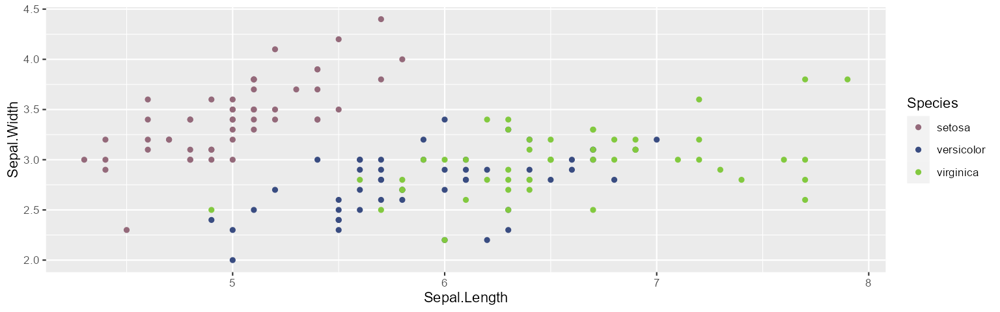
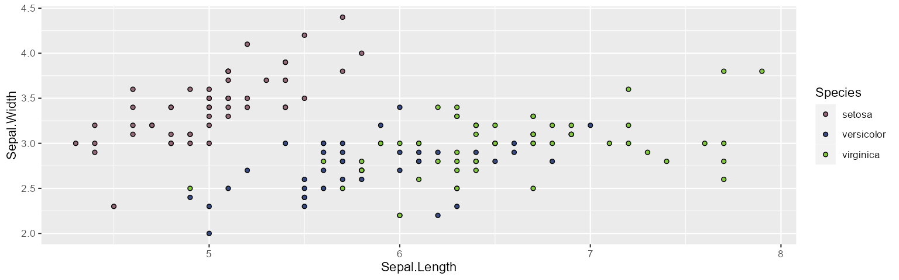

<!-- README.md is generated from README.Rmd. Please edit that file -->

# ggmonika

<!-- badges: start -->
<!-- badges: end -->

The goal of ggmonika is to provide color schemes for research papers for
ddlc enthusiasts.

## Installation

You can install the development version of ggmonika like so:

``` r
remotes::install_github('vinnish-A/ggmonika')
```

## Example

This is a basic example which shows you how to solve a common problem:

``` r
library(ggplot2)
library(ggmonika)

iris |> 
  ggplot(aes(Sepal.Length, Sepal.Width, color = Species)) +
  geom_point() +
  scale_color_monika()
```



``` r

iris |> 
  ggplot(aes(Sepal.Length, Sepal.Width, fill = Species)) +
  geom_point(shape = 21) +
  scale_fill_monika()
```


